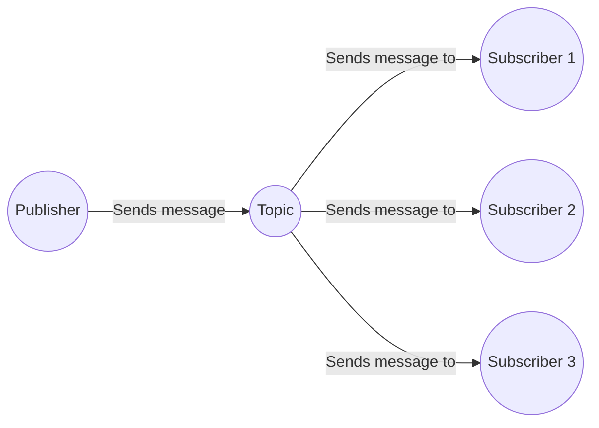
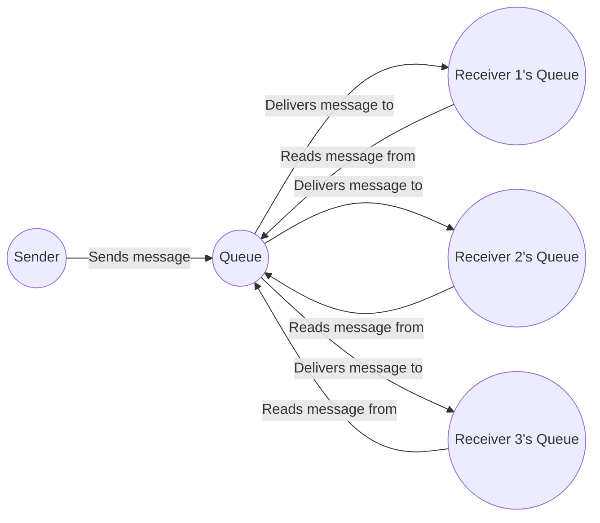

Cloud computing basics: It's important to have a basic understanding of cloud computing concepts, such as infrastructure as a service (IaaS), platform as a service (PaaS), and software as a service (SaaS). This will help you understand the different services and solutions that are available on Azure.

Distributed systems: Event-driven architecture often involves distributed systems, where different components of an application are deployed on separate servers or services. Understanding the basics of distributed systems can help you understand the challenges and benefits of using event-driven architecture.

Messaging systems: Messaging systems are often used in event-driven architecture to facilitate communication between different components of an application. Understanding the basics of messaging systems, such as message queues and publish/subscribe systems, can help you understand how events are propagated through an application.

Scalability and performance: Event-driven architecture can help improve the scalability and performance of applications, but it's important to understand the basics of how to design and deploy scalable and performant applications. This includes topics such as load balancing, caching, and horizontal scaling.

Azure services and solutions: It would also be useful to have a basic understanding of some of the Azure services and solutions that are commonly used in event-driven architecture, such as Azure Event Grid, Azure Functions, Azure Service Bus, and Azure Stream Analytics.

Azure Event Grid: Azure Event Grid is a fully-managed event routing service that enables event-driven architectures. It can route events from various Azure services and custom sources to event handlers such as Azure Functions, Azure Logic Apps, and even custom webhooks. Azure Event Grid allows decoupling of event producers from event consumers and provides a scalable and reliable eventing platform.

Azure Functions: Azure Functions is a serverless compute service that enables you to run code in response to events, such as changes to data in Azure Storage or a new message in an Azure Service Bus queue. Azure Functions can be written in various programming languages, including C#, JavaScript, and Python. The service automatically scales to meet demand and only charges for the time your functions run.

Azure Service Bus: Azure Service Bus is a messaging service that enables you to build distributed applications that are decoupled and scalable. It supports both pub/sub and message queuing patterns, and provides features such as transactions, batching, and dead-lettering. Azure Service Bus can be used for building event-driven architectures, processing data in real-time, and coordinating distributed systems.

Azure Stream Analytics: Azure Stream Analytics is a real-time data processing service that enables you to analyze and process streaming data from various sources, such as IoT devices or social media feeds. It supports various data sources, including Event Hubs, IoT Hub, and Azure Blob Storage. Azure Stream Analytics allows you to write SQL-like queries to process and analyze streaming data in real-time and provides integrations with other Azure services such as Azure Functions and Power BI.

## Pub Sub Vs MEssage Queue

Communication model: In pub/sub, publishers send messages to a topic, and subscribers receive messages from the topic. In message queuing, senders send messages to a queue, and receivers receive messages from the queue.

Message delivery: In pub/sub, all subscribers receive a copy of every message sent to the topic. In message queuing, messages are delivered to a single receiver from the queue. However, message queuing can also support multiple receivers if they are listening on different queues with different filters or message selectors.

Message persistence: In pub/sub, messages are not typically persisted in storage, as they are distributed to all subscribers in real-time. In message queuing, messages are typically stored in the queue until a receiver acknowledges receipt of the message.

Message ordering: In pub/sub, messages are typically delivered in the order they are published to the topic, but there is no guarantee of message ordering. In message queuing, messages are typically delivered in the order they are received in the queue.

